```{r, include= FALSE}
library(ggplot2)
library(plotly)
library(tidyverse)
library(flexdashboard)
library(readr)
library(signal)
library(tidymodels)
library(ggdendro)
library(heatmaply)
library(dplyr)
library(kknn)
library(patchwork)
library(magrittr)
library(ranger)
library(forcats)
library(dendextend)
library(tidyr)
library(recipes)

source("compmus.R")
```

```{r, include=FALSE}

get_conf_mat <- function(fit) {
  outcome <- .get_tune_outcome_names(fit)
  fit |> 
    collect_predictions() |> 
    conf_mat(truth = outcome, estimate = .pred_class)
}  

get_pr <- function(fit) {
  fit |> 
    conf_mat_resampled() |> 
    group_by(Prediction) |> mutate(precision = Freq / sum(Freq)) |> 
    group_by(Truth) |> mutate(recall = Freq / sum(Freq)) |> 
    ungroup() |> filter(Prediction == Truth) |> 
    select(class = Prediction, precision, recall)
}

compmus2025 <- read_csv("compmus2025.csv")
```


```{r, include = FALSE}
#      C     C#    D     Eb    E     F     F#    G     Ab    A     Bb    B
major_chord <-
  c(   1,    0,    0,    0,    1,    0,    0,    1,    0,    0,    0,    0)
minor_chord <-
  c(   1,    0,    0,    1,    0,    0,    0,    1,    0,    0,    0,    0)
seventh_chord <-
  c(   1,    0,    0,    0,    1,    0,    0,    1,    0,    0,    1,    0)

major_key <-
  c(6.35, 2.23, 3.48, 2.33, 4.38, 4.09, 2.52, 5.19, 2.39, 3.66, 2.29, 2.88)
minor_key <-
  c(6.33, 2.68, 3.52, 5.38, 2.60, 3.53, 2.54, 4.75, 3.98, 2.69, 3.34, 3.17)

chord_templates <-
  tribble(
    ~name, ~template,
    "Gb:7", circshift(seventh_chord, 6),
    "Gb:maj", circshift(major_chord, 6),
    "Bb:min", circshift(minor_chord, 10),
    "Db:maj", circshift(major_chord, 1),
    "F:min", circshift(minor_chord, 5),
    "Ab:7", circshift(seventh_chord, 8),
    "Ab:maj", circshift(major_chord, 8),
    "C:min", circshift(minor_chord, 0),
    "Eb:7", circshift(seventh_chord, 3),
    "Eb:maj", circshift(major_chord, 3),
    "G:min", circshift(minor_chord, 7),
    "Bb:7", circshift(seventh_chord, 10),
    "Bb:maj", circshift(major_chord, 10),
    "D:min", circshift(minor_chord, 2),
    "F:7", circshift(seventh_chord, 5),
    "F:maj", circshift(major_chord, 5),
    "A:min", circshift(minor_chord, 9),
    "C:7", circshift(seventh_chord, 0),
    "C:maj", circshift(major_chord, 0),
    "E:min", circshift(minor_chord, 4),
    "G:7", circshift(seventh_chord, 7),
    "G:maj", circshift(major_chord, 7),
    "B:min", circshift(minor_chord, 11),
    "D:7", circshift(seventh_chord, 2),
    "D:maj", circshift(major_chord, 2),
    "F#:min", circshift(minor_chord, 6),
    "A:7", circshift(seventh_chord, 9),
    "A:maj", circshift(major_chord, 9),
    "C#:min", circshift(minor_chord, 1),
    "E:7", circshift(seventh_chord, 4),
    "E:maj", circshift(major_chord, 4),
    "G#:min", circshift(minor_chord, 8),
    "B:7", circshift(seventh_chord, 11),
    "B:maj", circshift(major_chord, 11),
    "D#:min", circshift(minor_chord, 3)
  )

key_templates <-
  tribble(
    ~name, ~template,
    "Gb:maj", circshift(major_key, 6),
    "Bb:min", circshift(minor_key, 10),
    "Db:maj", circshift(major_key, 1),
    "F:min", circshift(minor_key, 5),
    "Ab:maj", circshift(major_key, 8),
    "C:min", circshift(minor_key, 0),
    "Eb:maj", circshift(major_key, 3),
    "G:min", circshift(minor_key, 7),
    "Bb:maj", circshift(major_key, 10),
    "D:min", circshift(minor_key, 2),
    "F:maj", circshift(major_key, 5),
    "A:min", circshift(minor_key, 9),
    "C:maj", circshift(major_key, 0),
    "E:min", circshift(minor_key, 4),
    "G:maj", circshift(major_key, 7),
    "B:min", circshift(minor_key, 11),
    "D:maj", circshift(major_key, 2),
    "F#:min", circshift(minor_key, 6),
    "A:maj", circshift(major_key, 9),
    "C#:min", circshift(minor_key, 1),
    "E:maj", circshift(major_key, 4),
    "G#:min", circshift(minor_key, 8),
    "B:maj", circshift(major_key, 11),
    "D#:min", circshift(minor_key, 3)
  )
```

# Introduction {.tabset}

Row 
----------------------------------

### AI is gradually taking over the world, including the music industry. When it comes to music production, the possibilities are endless—different genres, tempos, melodies, everything. That might be what makes it so exciting. What if a corpus was created to compare just how different all these various pieces of music really are?

```{r}
valueBox( "The Purpose ")
```

Row 
-----------------------
### Students of the course Computational Musicology were asked to make two tracks either using AI or composing their own. All these tracks were put in a corpus, which is used in this portfolio. For all the tracks in the corpus different features were computed: arousal, danceability, valence, instrumentalness and tempo. Based on these features, different kinds of computations will be made. 
```{r}
valueBox( "The Corpus ")
```

Row 
-----------------------

###  This portfolio was made for the course Computational Musicology at the UvA and is made by Ellen Rosmalen. 

```{r}
valueBox('The Portfolio')
```


The Corpus {.storyboard}
=====================

### Hierarchical dendogram
```{r dendrogram_plot, echo=FALSE, results='asis'}
cluster_juice <-
  recipe(
    filename ~
      arousal +
      danceability +
      instrumentalness +
      tempo +
      valence,
    data = compmus2025
  ) |>
  step_center(all_predictors()) |>
  step_scale(all_predictors()) |>
  prep(compmus2025) |>
  juice() |>
  column_to_rownames("filename")

compmus_dist <- dist(cluster_juice, method = "euclidean")

dendro_plot <- compmus_dist |>
  hclust(method = "complete") |>
  dendro_data() |>
  ggdendrogram()

ggsave("dendrogram.png", dendro_plot, width = 12, height = 10)

text_dendrogram <- "
This hierarchical dendogram shows the manner in which individual elements are increasingly merged into clusters. In this specific image, the x-axis contains labels resembling the filenames, but are not readable due to being too crowded. The y-axis quantifies the linkage distance or height with which clusters are combined. Clustering structure is observed to exhibit several large branches, as well as some of the subclusters growing at low levels, indicating varying similarities among the elements.
"

cat("<div style='display: flex; flex-direction: row;'>")
cat("<div style='display: flex; flex-direction: row;'>")
cat("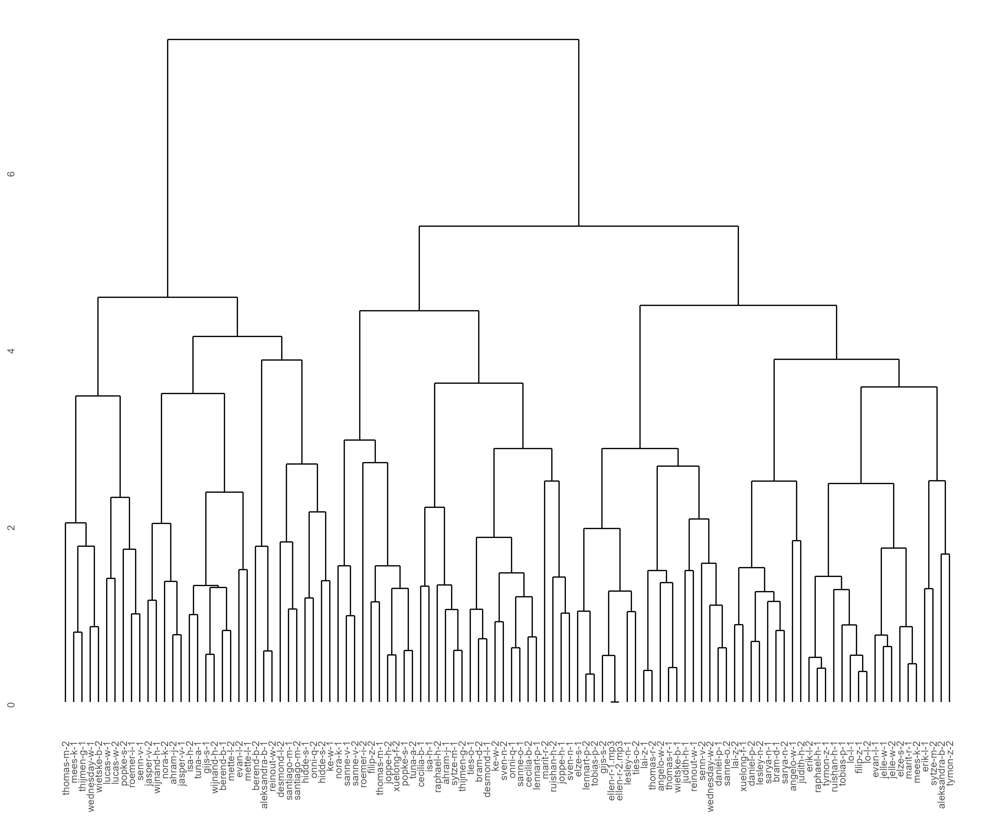")
cat("</div>")
cat(paste0("<div style='flex: 1; padding-left: 40px;'>", text_dendrogram, "</div>"))
cat("</div>")
```


### Hierarchical heatmap
```{r}
heatmaply(
  cluster_juice,
  hclustfun = hclust,
  hclust_method = "average",  # Change for single, average, or complete linkage.
  dist_method = "euclidean"
)
```
***
This heatmap reveals a clear pattern of clustering, as the hierarchical dendrograms on both axes display how features and data points cluster together. Columns such as "valence" and "danceability" clearly display vertical patterns, which correspond to strong correlation in some of the clusters. There are extreme color patterns also, with some features such as "instrumentalness" showing distinct dark purple regions, representing very low values for some data points. Also, the row dendrogram to the right side shows most the data points are merging late, which is due to the feature of single linkage clustering that will create long rather than tight groups. The heat map color trend shows there isn't a characteristic that is repeatedly high or low in all data, and thus there is diversity in data. 

### Overview; AI-made or not? 
```{r}
compmus2025_filtered <- compmus2025 %>%
  dplyr::filter(!is.na(ai)) %>%
  dplyr::mutate(ai = factor(if_else(ai, "AI", "Non-AI")))

p <- compmus2025_filtered |>
  ggplot(aes(x = arousal, y = valence, colour = ai, size = tempo, 
             text = paste("Filename:", filename, 
                          "<br>Arousal:", arousal, 
                          "<br>Valence:", valence, 
                          "<br>Tempo:", tempo,
                          "<br>AI or Non-AI:", ai))) +
  geom_point(alpha = 0.8) +
  scale_color_viridis_d() +
  labs(
    x = "Valence",
    y = "Arousal",
    size = "Tempo",
    colour = "AI"
  )

ggplotly(p, tooltip = "text")

```
***
A scatterplot was made to get an insight on the usage of Ai in the corpus, were yellow indicates that it is not an AI-made song and purple that it is. The size of the data-point indicates tempo; on the y-axis is arousal and on the x-axis valence. In this scatterplot one can see that there is not any particular clustering of Ai-made tracks and self-composed tracks.

### But how good is AI in predicting AI-generated tracks actually?
```{r ai_prediction_plots, echo=FALSE, results='asis'}
classification_recipe <-
  recipe(
    ai ~
      arousal +
      danceability +
      instrumentalness +
      tempo +
      valence,
    data = compmus2025_filtered
  ) |>
  step_center(all_predictors()) |>
  step_scale(all_predictors())

compmus_cv <- compmus2025_filtered |> vfold_cv(5)

knn_model <-
  nearest_neighbor(neighbors = 1) |>
  set_mode("classification") |>
  set_engine("kknn")

classification_knn <-
  workflow() |>
  add_recipe(classification_recipe) |>
  add_model(knn_model) |>
  fit_resamples(compmus_cv, control = control_resamples(save_pred = TRUE))


ggsave("knn_confusion_matrix.png", classification_knn |> get_conf_mat() |> autoplot(type = "heatmap"), width = 10, height = 8)


text_output_knn <- "
This confusion matrix evaluates the performance of a binary classification model, categorizing data into 'AI' and 'Non-AI'. The matrix reveals that the model achieved an accuracy of 60%, correctly predicting 33 instances of 'AI' and 21 instances of 'Non-AI'. However, the model also exhibited a 40% error rate, misclassifying 20 instances of 'Non-AI' as 'AI' (false positives) and 16 instances of 'AI' as 'Non-AI' (false negatives). The precision for 'AI' is approximately 62%, indicating that when the model predicts 'AI', it is correct 62% of the time, while the recall for 'AI' is about 67%, signifying that the model captures 67% of all actual 'AI' instances.
"


forest_model <-
  rand_forest() |>
  set_mode("classification") |>
  set_engine("ranger", importance = "impurity")

indie_forest <-
  workflow() |>
  add_recipe(classification_recipe) |>
  add_model(forest_model) |>
  fit_resamples(
    compmus_cv,
    control = control_resamples(save_pred = TRUE)
  )


variable_importance_plot <- workflow() |>
  add_recipe(classification_recipe) |>
  add_model(forest_model) |>
  fit(compmus2025_filtered) |>
  pluck("fit", "fit", "fit") |>
  ranger::importance() |>
  enframe() |>
  mutate(name = fct_reorder(name, value)) |>
  ggplot(aes(name, value)) +
  geom_col() +
  coord_flip() +
  theme_minimal() +
  labs(x = NULL, y = "Importance")

ggsave("variable_importance.png", variable_importance_plot, width = 10, height = 8)


text_output_forest <- "
This plot shows the importance of each variable in predicting whether a track is AI-generated or not, using a Random Forest model. The importance is measured by the impurity of the nodes in the decision trees. The higher the value, the more important the variable is. From this plot, we can see that instrumentalness was the most influential in the model's predictions.
"

cat("<div style='display: flex; flex-direction: row;'>")
cat("<div style='display: flex; flex-direction: row;'>")
cat("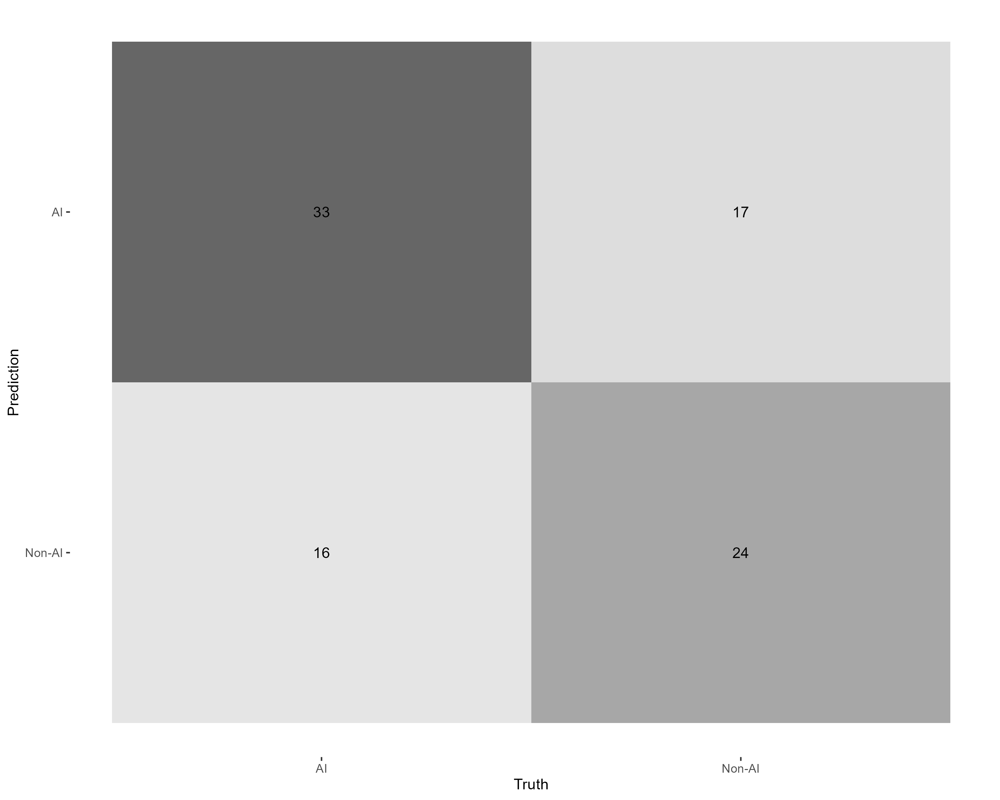")
cat("</div>")
cat(paste0("<div style='flex: 1; padding-left: 40px;'>", text_output_knn, "</div>"))
cat("</div>")

cat("<div style='display: flex; flex-direction: row;'>")
cat("<div style='display: flex; flex-direction: row;'>")
cat("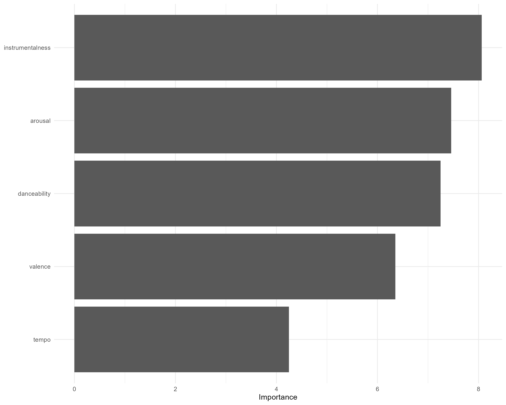")
cat("</div>")
cat(paste0("<div style='flex: 1; padding-left: 40px;'>", text_output_forest, "</div>"))
cat("</div>")
```


Visualisations {.storyboard}
===================
### Arousal, Valence, Tempo, Instrumentalness; which has which?

```{r}
info <- read.csv('compmus2025.csv')

Plot1 <- ggplot(info, aes(x = arousal, y = valence, colour = tempo, size = instrumentalness, 
                          text = paste("Filename:", filename, 
                                       "<br>Arousal:", arousal, 
                                       "<br>Valence:", valence, 
                                       "<br>Tempo:", tempo, 
                                       "<br>Instrumentalness:", instrumentalness))) + 
  geom_jitter(alpha = 0.8) + 
  ggtitle("Scatterplot displaying the corpus by arousal, valence, tempo and instrumentalness")

ggplotly(Plot1, tooltip = "text")

```
***
In this scatterplot on the y-axis is valence, the x-axis arousal, this size of the data-point instrumentalness and the color is of the data-point is tempo. Interesting to see is that tracks with a high instrumentalness, have a mostly a lower arousal and tempo. This will be the foundation for further analysis. On the basis of the features valence, arousal, tempo and instrumentalness one could say tobias-p-1 and reinout-w-2 are eachother extremes. How can we visualize these extremes? In this portofolio the tracks of Tobias and Reinout will be compared, without listening to the tracks. The comparisons will be made on the basis of several plots: chromagrams, self-similarity matrix', chordograms, novelty functions and tempograms. 

### Chromagrams of Tobias' and Reinouts track
```{r chromagram_plots, echo=FALSE, results='asis'}
plot_tobias_chroma <- "features/tobias-p-1.json" |>
  compmus_chroma(norm = "identity") |>
  ggplot(aes(x = time, y = pc, fill = value)) +
  geom_raster() +
  scale_y_continuous(
    breaks = 0:11,
    minor_breaks = NULL,
    labels = c(
      "C", "C#|Db", "D", "D#|Eb",
      "E", "F", "F#|Gb", "G",
      "G#|Ab", "A", "A#|Bb", "B"
    )
  ) +
  scale_fill_viridis_c(guide = "none") +
  labs(title = "Chromagram of Tobias' Track", x = "Time (s)", y = NULL, fill = NULL) +
  theme_classic()

plot_reinout_chroma <- "features/reinout-w-2.json" |>
  compmus_chroma(norm = "identity") |>
  ggplot(aes(x = time, y = pc, fill = value)) +
  geom_raster() +
  scale_y_continuous(
    breaks = 0:11,
    minor_breaks = NULL,
    labels = c(
      "C", "C#|Db", "D", "D#|Eb",
      "E", "F", "F#|Gb", "G",
      "G#|Ab", "A", "A#|Bb", "B"
    )
  ) +
  scale_fill_viridis_c(guide = "none") +
  labs(title = "Chromagram of Reinout's Track", x = "Time (s)", y = NULL, fill = NULL) +
  theme_classic()

ggsave("tobias_chroma.png", plot_tobias_chroma, width = 10, height = 8) 
ggsave("reinout_chroma.png", plot_reinout_chroma, width = 10, height = 8) 


text_output_chroma <- "
These chromagrams represent the intensity of different pitch classes over time. This visualization highlights the harmonic content of the tracks, showing which notes are most prominent at each moment. Patterns in the chromagram can indicate key changes, chord progressions, or repeating harmonic structures. Both the chromagrams of Tobias and Reinout show that the tracks do not consistently emphasize specific pitch classes. However, Tobias's track exhibits more structural consistency. This is evident in the specific, lighter bands that repeat over time. These structural patterns are significantly less present in Reinout's chromagram, suggesting that his track is harmonically less organized or contains more atonal elements.
"

cat("<div style='display: flex; flex-direction: row;'>") 
cat("<div style='display: flex; flex-direction: row;'>") 
cat("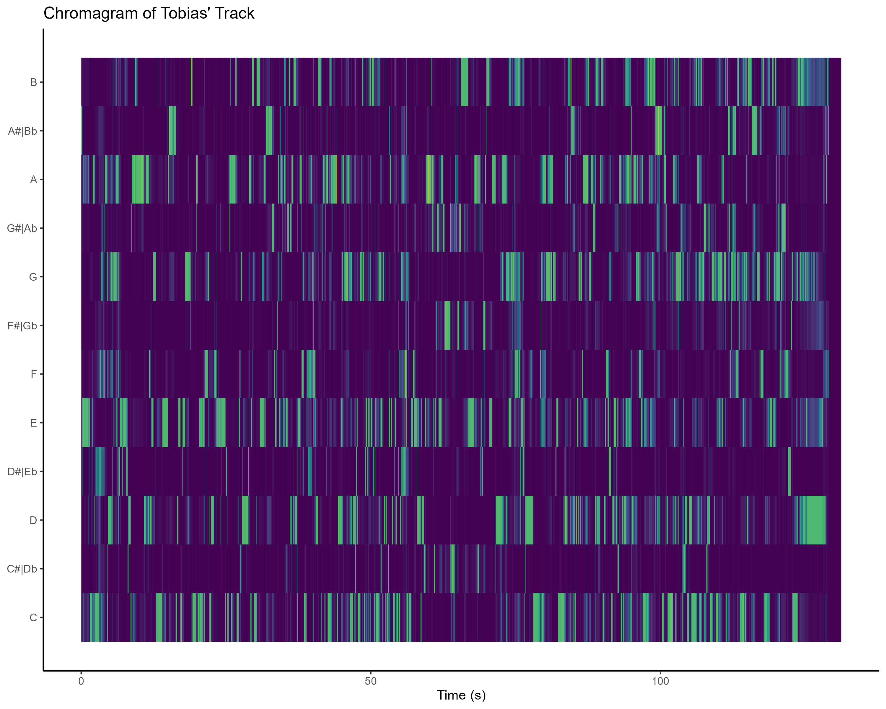") 
cat("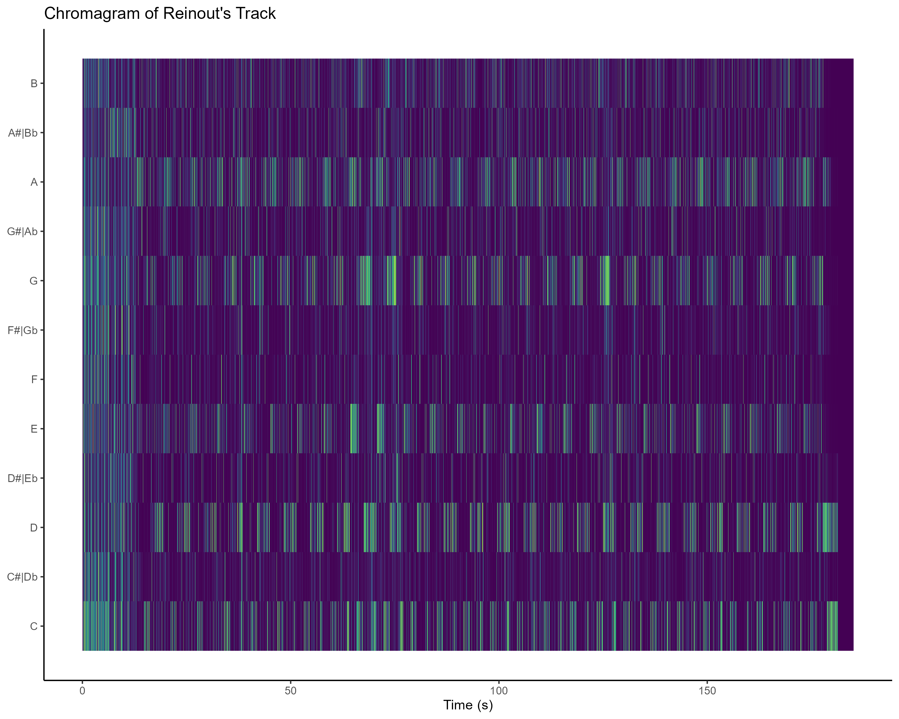") 
cat("</div>") 
cat(paste0("<div style='flex: 1; padding-left: 40px;'>", text_output_chroma, "</div>")) 
cat("</div>") 
```


### Self-similarity matrix based on chroma of Tobias' and Reinouts track
```{r self_similarity_chroma_plots, echo=FALSE, results='asis'}
plot_tobias_chroma_ssm <- "features/tobias-p-1.json" |>
  compmus_chroma(norm = "identity") |>
  compmus_self_similarity(
    feature = pc,
    distance = "euclidean"
  ) |>
  ggplot(aes(x = xtime, y = ytime, fill = d)) +
  geom_raster() +
  scale_fill_viridis_c(guide = "none") +
  labs(title = "Self-Similarity Matrix Based on Chroma of Tobias' Track", x = "Time (s)", y = NULL, fill = NULL) +
  theme_classic()


plot_reinout_chroma_ssm <- "features/reinout-w-2.json" |>
  compmus_chroma(norm = "identity") |>
  compmus_self_similarity(
    feature = pc,
    distance = "euclidean"
  ) |>
  ggplot(aes(x = xtime, y = ytime, fill = d)) +
  geom_raster() +
  scale_fill_viridis_c(guide = "none") +
  labs(title = "Self-Similarity Matrix Based on Chroma of Reinout's Track", x = "Time (s)", y = NULL, fill = NULL) +
  theme_classic()


ggsave("tobias_chroma_ssm.png", plot_tobias_chroma_ssm, width = 10, height = 8) 
ggsave("reinout_chroma_ssm.png", plot_reinout_chroma_ssm, width = 10, height = 8) 


text_output_chroma_ssm <- "
These self-similarity matrices are based on chroma features. These matrices reveal the structural characteristics of the tracks by comparing their harmonic content over time. A strong diagonal line indicates perfect self-similarity, meaning the music maintains consistency over time. Additionally, block-like patterns suggest recurring sections, such as verses and choruses. Neither of the self-similarity matrices for Tobias's and Reinout's tracks contain these block-like patterns. However, they both exhibit a grid-like formation, but a difference is noticeable between the two tracks. Apart from the first 10 seconds, Reinout's track displays a predominantly blue grid-like formation, indicating that its chroma features are consistent and repeating throughout the song. Conversely, Tobias's track shows a predominantly green matrix, suggesting a lot of harmonic variation.
"
# Generate HTML output
cat("<div style='display: flex; flex-direction: row;'>") 
cat("<div style='display: flex; flex-direction: row;'>") 
cat("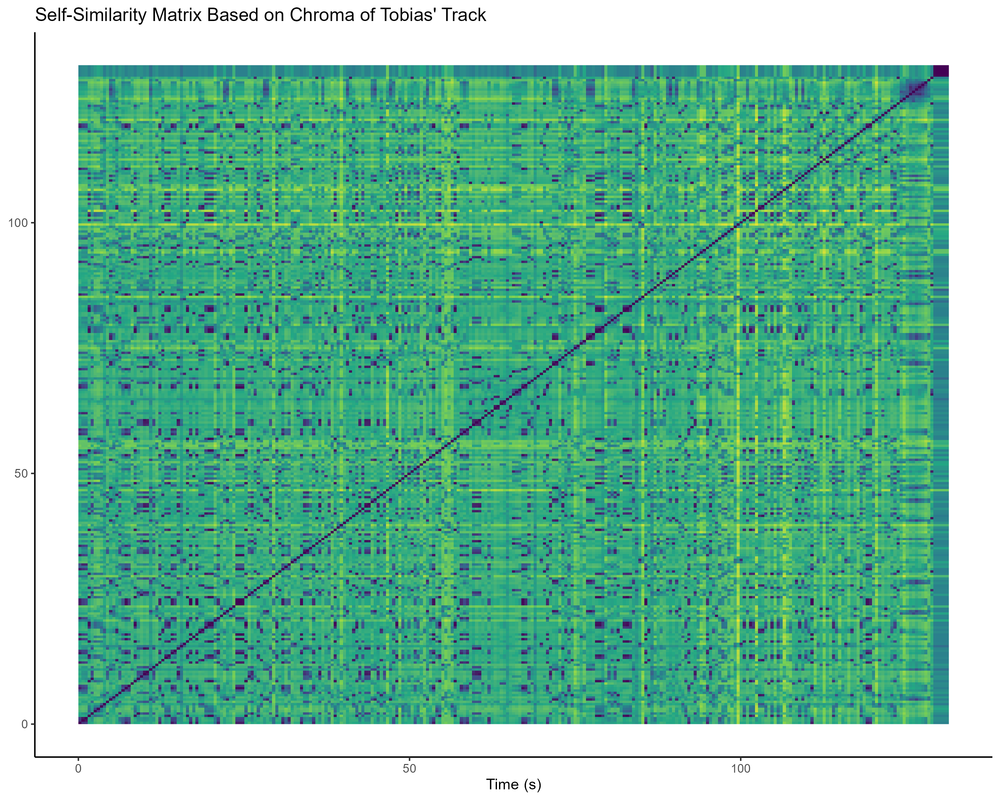") 
cat("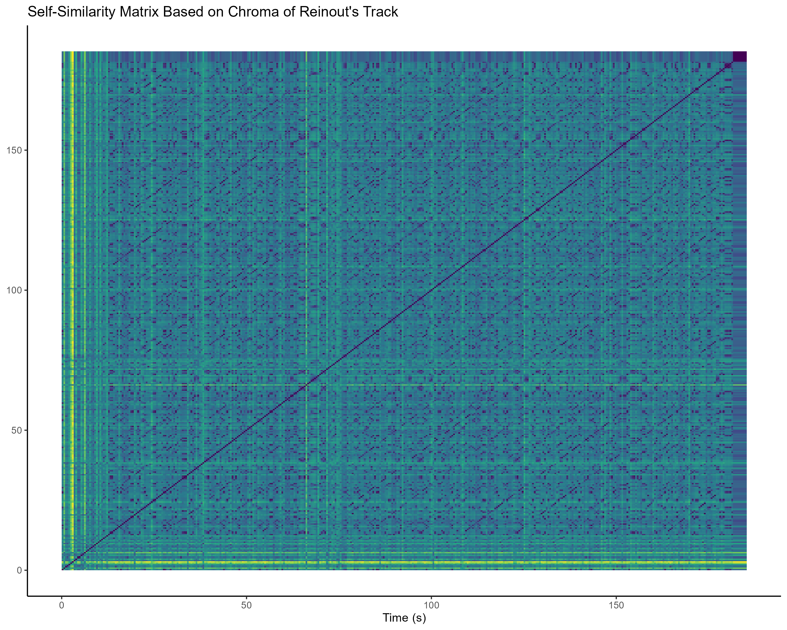")
cat("</div>") 
cat(paste0("<div style='flex: 1; padding-left: 40px;'>", text_output_chroma_ssm, "</div>")) 
cat("</div>") 
```


### Self-similarity matrix based on timbre of Tobias' and Reinouts track
```{r self_similarity_plots, echo=FALSE, results='asis'}
plot_tobias_ssm <- "features/tobias-p-1.json" |>
  compmus_mfccs(norm = "identity") |>
  compmus_self_similarity(
    feature = mfcc,
    distance = "euclidean"
  ) |>
  ggplot(aes(x = xtime, y = ytime, fill = d)) +
  geom_raster() +
  scale_fill_viridis_c(guide = "none") +
  labs(title = "Self-Similarity Matrix Based on Timbre of Tobias' Track", x = "Time (s)", y = NULL, fill = NULL) +
  theme_classic()

plot_reinout_ssm <- "features/reinout-w-2.json" |>
  compmus_mfccs(norm = "identity") |>
  compmus_self_similarity(
    feature = mfcc,
    distance = "euclidean"
  ) |>
  ggplot(aes(x = xtime, y = ytime, fill = d)) +
  geom_raster() +
  scale_fill_viridis_c(guide = "none") +
  labs(title = "Self-Similarity Matrix Based on Timbre of Reinout's Track", x = "Time (s)", y = NULL, fill = NULL) +
  theme_classic()

ggsave("tobias_ssm.png", plot_tobias_ssm, width = 10, height = 8) 
ggsave("reinout_ssm.png", plot_reinout_ssm, width = 10, height = 8) 

text_output_ssm <- "
These self-similarity matrices are based on timbre features. Timbre refers to the texture and tone color of the sound, often shaped by instrument choice and production techniques. 1  The timbre patterns in Tobias's and Reinout's tracks are quite similar. Both songs maintain a consistent, repeating timbre for most of their duration. In Tobias's track, this consistency lasts until around the 140-second mark, while in Reinout's, it continues until approximately 190 seconds. For the final ten seconds of each track, however, there's a noticeable shift to a new timbre. The main difference between the two tracks lies in a subtle change around the 80-second point in Tobias's song. Here, a light blue line indicates a brief, minor shift in timbre, which returns to the original sound within a few seconds (roughly five). In contrast, Reinout's track appears to have no noticeable timbre changes before the final ten-second shift.
"

cat("<div style='display: flex; flex-direction: row;'>") 
cat("<div style='display: flex; flex-direction: row;'>") 
cat("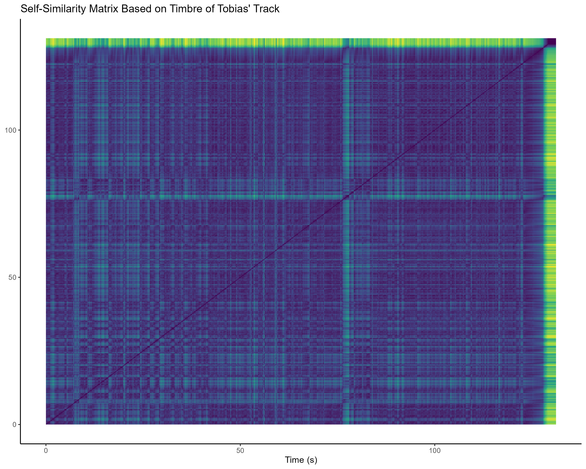") 
cat("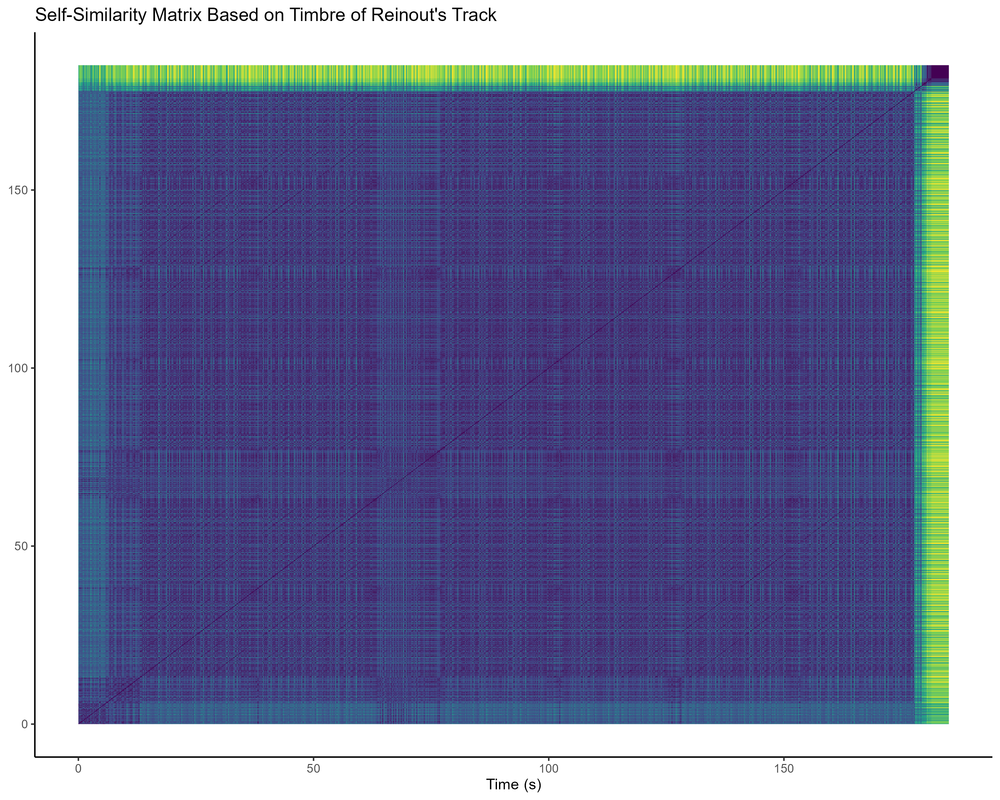") 
cat("</div>") 
cat(paste0("<div style='flex: 1; padding-left: 40px;'>", text_output_ssm, "</div>")) 
cat("</div>") 
```


### Chordograms of Tobias' and Reinouts track
```{r chordogram_plots, echo=FALSE, results='asis'}
plot_tobias3 <- "features/tobias-p-1.json" |>
  compmus_chroma(norm = "identity") |>
  compmus_match_pitch_templates(
    chord_templates,
    norm = "identity",
    distance = "cosine"
  ) |>
  ggplot(aes(x = time, y = name, fill = d)) +
  geom_raster() +
  scale_fill_viridis_c(guide = "none") +
  labs(title = "Chordograms of Tobias' Track", x = "Time (s)", y = "Template", fill = NULL) +
  theme_classic()

plot_reinout3 <- "features/reinout-w-2.json" |>
  compmus_chroma(norm = "identity") |>
  compmus_match_pitch_templates(
    chord_templates,
    norm = "identity",
    distance = "cosine"
  ) |>
  ggplot(aes(x = time, y = name, fill = d)) +
  geom_raster() +
  scale_fill_viridis_c(guide = "none") +
  labs(title = "Chordograms of Reinout's Track", x = "Time (s)", y = "Template", fill = NULL) +
  theme_classic()


ggsave("tobias_chordogram.png", plot_tobias3, width = 10, height = 8) 
ggsave("reinout_chordogram.png", plot_reinout3, width = 10, height = 8) 


text_output3 <- "
These chordograms display matches between the audio and pre-defined chord templates. Think of these templates as 'ideal' versions of chords. The chordogram shows how well the audio fits these templates, indicating the likelihood that specific chords are being played. Dark blue areas suggest a strong match, while yellow areas suggest a poor match. This helps us identify the chords that are most prominent in the music.

Comparing the chordograms reveals some similarities and differences between the two tracks. In Tobias's track, we see clear matches for C major, C dominant 7th, and A minor in the first 60 seconds. Then, there's a shift, with A dominant 7th and A major becoming more prominent. Finally, it returns to C major, C dominant 7th, and A minor. Interestingly, in the last ten seconds, we see strong matches for G dominant 7th, G major, and B minor. This aligns with the timbre self-similarity matrix, which also indicated a change in timbre during that final section.

Reinout's track starts with strong matches across many chords in the first fifteen seconds, indicated by the light blue and blue bars. After that, the chordogram struggles to identify clear chords, with occasional matches for A major, D major, C major, A minor, G minor, and C minor. However, these matches are inconsistent and vary throughout the song. In the final ten seconds, the chordogram again shows difficulty in determining the played chords.
"
# Generate HTML output
cat("<div style='display: flex; flex-direction: row;'>") 
cat("<div style='display: flex; flex-direction: row;'>") 
cat("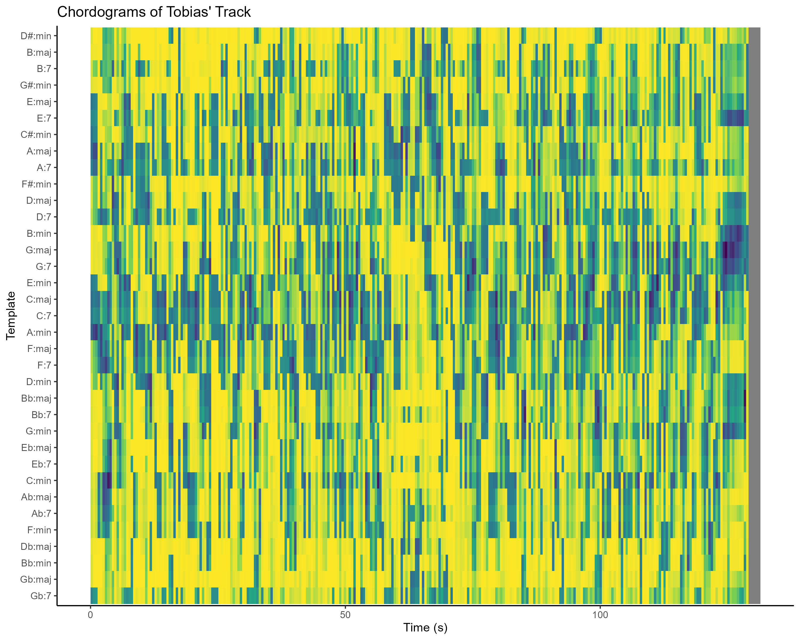") 
cat("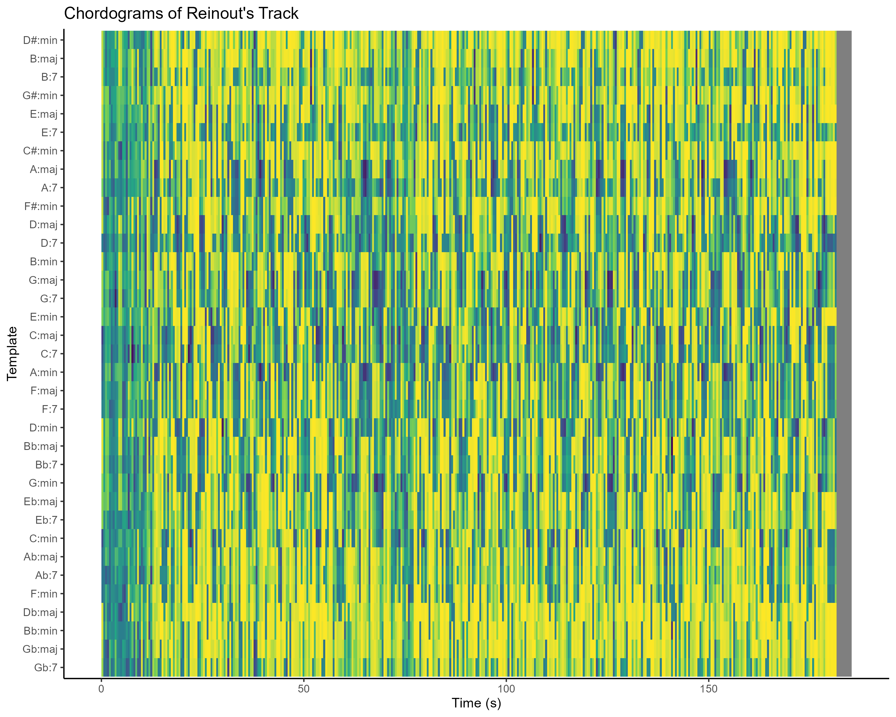") 
cat("</div>") 
cat(paste0("<div style='flex: 1; padding-left: 40px;'>", text_output3, "</div>")) 
cat("</div>")
```

### Energy-Novelty Functions of Tobias' and Reinouts track
```{r energy_novelty_plots, echo=FALSE, results='asis'}
data1 <- compmus_energy_novelty("features/tobias-p-1.json")
fig1 <- (ggplot(data1, aes(t, novelty)) +
  geom_line() +
  theme_minimal() +
  coord_cartesian(ylim = c(0, 6)) +  
  labs(title = "Energy Novelty of Tobias' Track", x = "Time (s)", y = "Energy Novelty"))

data2 <- compmus_energy_novelty("features/reinout-w-2.json")
fig2 <- (ggplot(data2, aes(t, novelty)) +
  geom_line() +
  theme_minimal() +
  coord_cartesian(ylim = c(0, 0.5)) +
  labs(title = "Energy Novelty of Reinouts Track", x = "Time (s)", y = "Energy Novelty"))

combined_plot2 <- fig1 / fig2

text_output2 <- "
These energy novelty plots compare how the overall energy changes over time in Tobias's and Reinout's tracks. Tobias’s track shows infrequent, but high-amplitude, energy fluctuations, meaning there are sudden, large changes in its energy. You can see this as isolated, tall spikes, with a notable one around the 70-second mark, indicating an abrupt increase in energy. Reinout’s track, in contrast, has a consistently lower level of energy novelty, with more frequent, but less intense, energy changes. For example, there's a smaller, less dramatic peak around the 60-second mark. Both tracks, however, show a drop towards zero at the end, meaning the energy becomes very stable as they conclude.
"

cat("<div style='display: flex; flex-direction: row;'>") 
print(combined_plot2) 
cat(paste0("<div style='flex: 1; padding-left: 20px;'>", text_output2, "</div>")) 
cat("</div>") 
```

### Spectral-Novelty Functions of Tobias' and Reinouts track
```{r spectral_novelty_plots, echo=FALSE, results='asis'}

data3 <- compmus_spectral_novelty("features/tobias-p-1.json")
fig3 <- (ggplot(data3, aes(t, novelty)) +
  geom_line() +
  theme_minimal() +
  coord_cartesian(ylim = c(0, 0.25)) +
  labs(title = "Spectral Novelty of Tobias' Track", x = "Time (s)", y = "Spectral Novelty"))

data4 <- compmus_spectral_novelty("features/reinout-w-2.json")
fig4 <- (ggplot(data4, aes(t, novelty)) +
  geom_line() +
  theme_minimal() +
  coord_cartesian(ylim = c(0, 0.25)) +
  labs(title = "Spectral Novelty of Reinouts Track", x = "Time (s)", y = "Spectral Novelty"))

combined_plot1 <- fig3 / fig4

text_output1 <- "
These spectral novelty plots compare how the frequency of the sound changes over time in Tobias' and Reinout's tracks. Reinout's track shows a consistently high level of spectral novelty, meaning there are a lot of rapid, sharp changes in its frequency content. You can see this as frequent, tall spikes throughout the plot, suggesting a dynamic and evolving soundscape. Tobias' track, in contrast, has a lower overall spectral novelty, with more stable periods interrupted by occasional, less intense spikes. For example, there's a clear spike around the 60-second mark, indicating a sudden increase in spectral variation. Both tracks, however, show a sharp drop to zero at the end, which means the spectral content becomes very stable as they conclude.
"

cat("<div style='display: flex; flex-direction: row;'>") 
print(combined_plot1) 
cat(paste0("<div style='flex: 1; padding-left: 20px;'>", text_output1, "</div>")) 
cat("</div>")
```

### Tempogram of Tobias' and Reinouts track
```{r tempogram_plots, echo=FALSE, results='asis'}

plot_tobias_tempogram <- "features/tobias-p-1.json" |>
  compmus_tempogram(window_size = 8, hop_size = 1, cyclic = TRUE) |>
  ggplot(aes(x = time, y = bpm, fill = power)) +
  geom_raster() +
  scale_fill_viridis_c(guide = "none") +
  labs(title = "Tempogram of Tobias' Track", x = "Time (s)", y = "Tempo (BPM)") +
  theme_classic()


plot_reinout_tempogram <- "features/reinout-w-2.json" |>
  compmus_tempogram(window_size = 8, hop_size = 1, cyclic = TRUE) |>
  ggplot(aes(x = time, y = bpm, fill = power)) +
  geom_raster() +
  scale_fill_viridis_c(guide = "none") +
  labs(title = "Tempogram of Reinouts Track", x = "Time (s)", y = "Tempo (BPM)") +
  theme_classic()

ggsave("tobias_tempogram.png", plot_tobias_tempogram, width = 10, height = 8)
ggsave("reinout_tempogram.png", plot_reinout_tempogram, width = 10, height = 8)

text_output_tempogram <- "These tempograms compare the rhythmic patterns of two tracks, revealing distinct tempo behaviors. The tempogram of Tobias' track exhibits a dynamic, evolving tempo, with a yellow band tracing a fluctuating tempo trajectory. Starting around 110 BPM, the tempo gradually increases, peaking around 125 BPM and 130 BPM, before settling at 120 BPM.  In contrast, The tempogram of Reinouts track displays a dominant tempo around 150 BPM, evident as a strong yellow band, suggesting a consistent rhythmic foundation. A secondary, less prominent band around 110 BPM, indicates occasional rhythmic variation. Thus, while Reinouts track emphasizes rhythmic consistency with occasional deviations, the Tobias' track is defined by continuous tempo evolution."

cat("<div style='display: flex; flex-direction: row;'>")
cat("<div style='display: flex; flex-direction: row;'>")
cat("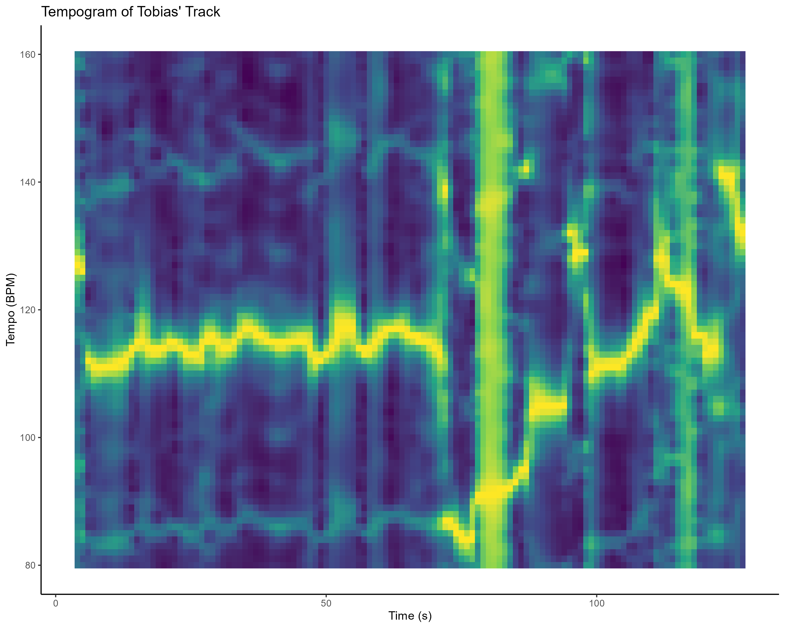")
cat("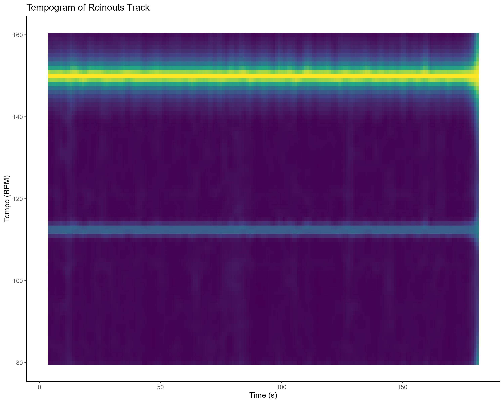")
cat("</div>")
cat(paste0("<div style='flex: 1; padding-left: 40px;'>", text_output_tempogram, "</div>"))
cat("</div>")
```


Conclusion and Discussion
===========

These previous analyses compare the characteristics of Tobias' and Reinouts tracks, revealing distinct musical approaches. Tobias' track exhibits a dynamic tempo, fluctuating between 110 and 130 BPM. Besides this there are infrequent but high-amplitude energy shifts, with a notable spike around the 70-second mark, indicating sudden, dramatic changes. The harmonic content, while not consistently emphasizing specific pitches, shows structured progressions and a notable shift in the final ten seconds, suggesting a carefully controlled evolution. Reinouts track, in contrast, maintains a consistent tempo around 150 BPM and features consistent, low-amplitude energy changes, with a more subtle peak around the 60-second mark. The harmonic content, while repetitive, lacks the structured progressions of Tobias' track. The high spectral novelty indicates a continuously evolving spectral landscape. Both tracks, however, share a significant timbral shift in their final ten seconds, suggesting a change in sonic texture as they conclude. Tobias' track is characterized by dramatic, structural shifts, potentially aligning with progressive or experimental genres, like a experimental jazz track. Reinouts track emphasizes rhythmic consistency and evolving textures, suggesting techno or ambient electronic influences.

You might be wondering: How do these songs sound? Well, I wont keep you waiting...

This is Tobias' track:

```{r, echo=FALSE, results='asis'}
cat('
<audio controls>
    <source src="tobias-p-1.mp3" type="audio/mpeg">
    Your browser does not support the audio element.
</audio>
')
```
This is Reinouts track:
```{r, echo=FALSE, results='asis'}
cat('
<audio controls>
    <source src="reinout-w-2.mp3" type="audio/mpeg">
    Your browser does not support the audio element.
</audio>
')
```
Analyzing Tobias's and Reinout's tracks using computational tools demonstrated how powerful these methods can be when applied independently. By examining changes in sound color, energy levels, chord patterns, and evolving textures, we uncovered what makes each track unique. Reinout’s track had a steady, evolving soundscape, while Tobias’s track stood out with dramatic energy shifts and structured chord progressions. Rather than simply describing the tracks, this approach allowed for a deeper exploration of their potential styles and how they were constructed.

What is exciting is that these skills are not just useful in this case, they can be applied to a wide range of musical analysis. The ability to break down and understand tracks in this way allows for tackling broader challenges, such as automatically sorting music by style or determining what gives a song its distinctive character. This kind of independent analysis creates new possibilities for researchers, producers, educators, and music creators, helping them gain fresh and unexpected insights into how music is structured and composed.

